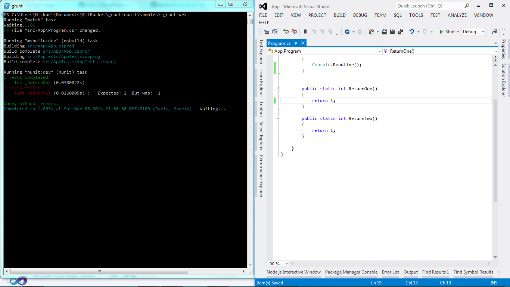

# grunt-simple-nunit-runner and continuous testing flow 

Using the tasks [grunt-msbuild](https://github.com/stevewillcock/grunt-msbuild) and [grunt-contrib-watch](https://github.com/gruntjs/grunt-contrib-watch), you can get immediate feedback for each modification.

